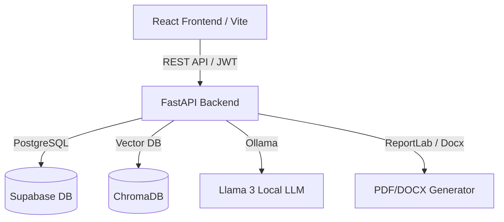
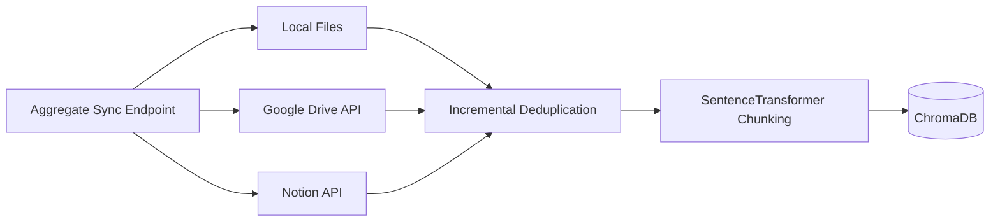
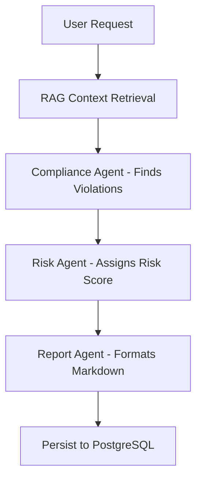

# Enterprise Compliance & Audit Intelligence Platform


## Project Overview
The **Enterprise Compliance & Audit Intelligence Platform** is a state-of-the-art compliance management system that unifies disparate knowledge sources (Local Files, Google Drive, Notion) into a single, intelligent interface. Utilizing advanced Retrieval-Augmented Generation (RAG) and multi-agent LangGraph workflows, the platform autonomously evaluates organizational policies against regulatory requirements to produce accurate, traceable, and actionable audit reports.

## Problem Statement
Modern enterprises store critical compliance and policy documentation across deeply fragmented silos—some in local servers, some in Google Drive, and others in modern wikis like Notion. When audits occur, compliance officers spend weeks manually retrieving, collating, and cross-referencing these documents against shifting regulations. This manual process is slow, error-prone, and scales poorly. 

This platform solves this by autonomously indexing policies across all major enterprise storage solutions and deploying specialized AI agents to instantly evaluate regulatory alignment.

## Key Features
- **Multi-Source Knowledge Ingestion (MCP):** Connects to Local Storage, Google Drive, and Notion natively.
- **Incremental Vector Sync:** Uses smart deduplication to only chunk and embed new or modified documents.
- **RAG-Powered AI Workflow:** Employs a robust LangGraph pipeline containing a Compliance Agent, Risk Agent, and Report Synthesis Agent.
- **Full Role-Based Access Control (RBAC):** Ensures only authenticated Administrators can manage users, while Auditors can run workflows.
- **Live Health & Metrics Dashboard:** Monitors underlying infrastructure (PostgreSQL, ChromaDB, Ollama) and tracks synced document counts.
- **One-Click Export:** Download deeply analyzed compliance reports as PDF or DOCX directly from the browser.

## Architecture

### System Architecture


### Model Context Protocol (MCP) Architecture


### LangGraph RAG Workflow


## Technology Stack
- **Frontend:** React 19, TypeScript, Vite, TailwindCSS, Recharts, React Query.
- **Backend:** FastAPI, Python 3.11, SQLAlchemy, Pydantic, JWT.
- **AI / Data:** LangGraph, Ollama (Llama 3), ChromaDB, SentenceTransformers.
- **Integrations:** Google API Client, Notion API Client.
- **Infrastructure:** Docker, Docker Compose, PostgreSQL (Supabase).

## Installation & Deployment

### Local Development Setup
1. **Clone the repository:**
   ```bash
   git clone <repo-url> compliance-ai
   cd compliance-ai
   ```
2. **Configure Environment:**
   ```bash
   cp backend/.env.example backend/.env
   # Edit backend/.env with your Supabase DB URL, Notion Token, etc.
   ```
3. **Start the Database Proxy (if using Supabase IPv6 from an IPv4 host):**
   ```bash
   python backend/db_proxy.py
   ```
4. **Boot with Docker Compose:**
   ```bash
   docker-compose up --build -d
   ```
5. **Access the application:**
   - Frontend UI: `http://localhost:5173`
   - Backend API Docs: `http://localhost:8000/docs`

## API Documentation
The complete OpenAPI specification is automatically generated and accessible at `/docs` when the backend is running. Key endpoints include:
- `POST /api/v1/auth/login`: Issue JWT token.
- `POST /api/v1/mcp/sync`: Trigger aggregate deduplicated sync across all sources.
- `POST /api/v1/workflow/run`: Execute the LangGraph compliance audit.
- `GET /api/v1/health`: Fetch detailed status of all microservices and external APIs.
- `GET /api/v1/reports/{id}/export/pdf`: Download the final compliance report.

## Future Enhancements
- **Shared Drive Support:** Expand the Google Drive MCP integration to scan Enterprise Shared Drives (`supportsAllDrives=True`).
- **Slack/Teams Integration:** Automatically broadcast high-risk compliance failures to dedicated messaging channels.
- **Real-time WebSockets:** Replace long-polling in the AI workflow with real-time WebSocket streaming for faster UI feedback.

## Team Contributions
Built by the Advanced Agentic Coding Team.
