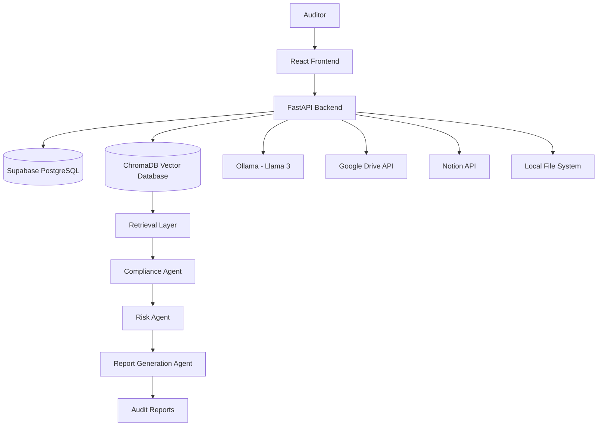
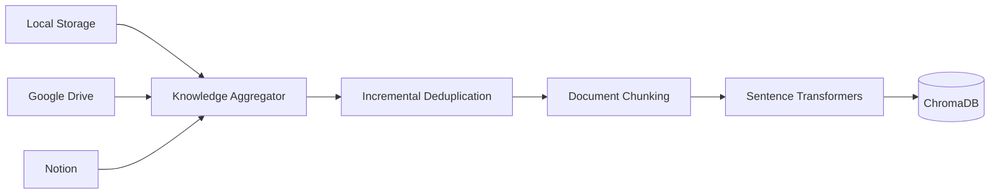
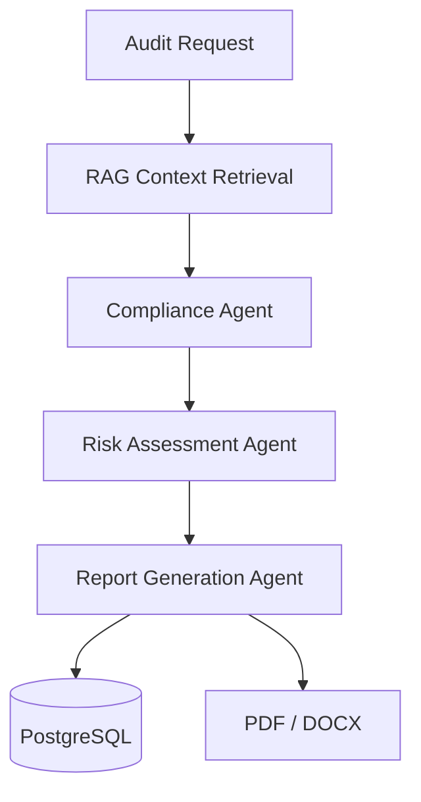

# Enterprise Compliance & Audit Intelligence Platform

> AI-Powered Enterprise Compliance Automation using Multi-Agent Systems, Retrieval-Augmented Generation (RAG), and Enterprise Knowledge Integration.


---

# Live Demo

### Frontend Application

🔗 https://autonomous-compliance-audit-platfor.vercel.app/

### Backend API Documentation

🔗 https://autonomous-compliance-audit-platform.onrender.com/docs

---

# Overview

The Enterprise Compliance & Audit Intelligence Platform is an AI-driven compliance automation solution designed to streamline enterprise audit workflows.

Organizations often store critical compliance information across multiple disconnected systems such as:

* Local File Repositories
* Google Drive
* Notion Workspaces

During audits, compliance teams spend significant time locating, validating, and cross-referencing documents against regulatory requirements.

This platform automates that process by leveraging:

* Retrieval-Augmented Generation (RAG)
* Multi-Agent AI Workflows
* Vector Search
* Enterprise Knowledge Integration
* Automated Risk Assessment

The system continuously ingests organizational policies, retrieves relevant context, evaluates compliance gaps, calculates risk scores, and generates professional audit reports.

---

# Problem Statement

Enterprise compliance audits face several challenges:

* Fragmented document storage
* Manual policy verification
* Time-consuming evidence collection
* Inconsistent compliance assessments
* Delayed audit reporting
* Poor scalability

These challenges increase operational costs and expose organizations to regulatory and compliance risks.

---

# Solution

The platform provides an end-to-end compliance intelligence workflow that:

✅ Aggregates enterprise knowledge from multiple sources

✅ Synchronizes and vectorizes enterprise documents

✅ Retrieves relevant regulatory context using RAG

✅ Executes autonomous compliance analysis

✅ Calculates compliance risk scores

✅ Generates structured audit reports

✅ Supports role-based access control (RBAC)

---

# Key Features

## Multi-Source Knowledge Ingestion (MCP)

Connect enterprise knowledge sources:

* Local File Systems
* Google Drive
* Notion

---

## Incremental Document Processing

The platform automatically detects:

* New documents
* Modified documents
* Duplicate content

Only changed documents are reprocessed, reducing computational costs.

---

## Retrieval-Augmented Generation (RAG)

Uses vector search to retrieve relevant organizational policies and regulatory content before generating responses.

---

## Multi-Agent Compliance Workflow

### Compliance Agent

Responsible for:

* Compliance evaluation
* Gap analysis
* Policy validation

### Risk Assessment Agent

Responsible for:

* Risk scoring
* Severity classification
* Prioritization

### Report Generation Agent

Responsible for:

* Audit report generation
* Recommendation synthesis
* Evidence traceability

---

## Role-Based Access Control (RBAC)

### Administrator

* Manage users
* Configure integrations
* Monitor platform health

### Auditor

* Run compliance audits
* Review reports
* Export findings

---

## Monitoring Dashboard

Real-time monitoring for:

* PostgreSQL
* ChromaDB
* Ollama
* Knowledge Sync Status

---

## Report Export

Generate professional reports in:

* PDF
* DOCX

---

# System Architecture



---

# MCP Knowledge Integration Workflow



---

# AI Workflow



---

# Project Structure

```text
enterprise-compliance-ai/
│
├── frontend/
│   ├── public/
│   ├── src/
│   │   ├── api/
│   │   ├── components/
│   │   ├── pages/
│   │   ├── hooks/
│   │   ├── services/
│   │   ├── utils/
│   │   └── App.tsx
│   │
│   ├── package.json
│   ├── vite.config.ts
│   └── vercel.json
│
├── backend/
│   ├── app/
│   │   ├── api/
│   │   ├── core/
│   │   ├── models/
│   │   ├── schemas/
│   │   ├── services/
│   │   ├── agents/
│   │   ├── workflows/
│   │   └── main.py
│   │
│   ├── requirements.txt
│   ├── Dockerfile
│   └── .env.example
│
├── docker-compose.yml
├── README.md
└── docs/
```

---

# Technology Stack

## Frontend

* React 19
* TypeScript
* Vite
* Tailwind CSS
* React Query
* Recharts

## Backend

* FastAPI
* SQLAlchemy
* Pydantic
* JWT Authentication
* Python 3.11

## AI & Machine Learning

* LangGraph
* Ollama
* Llama 3
* Sentence Transformers
* Retrieval-Augmented Generation (RAG)

## Databases

* Supabase PostgreSQL
* ChromaDB

## Integrations

* Google Drive API
* Notion API

## Infrastructure

* Docker
* Docker Compose
* Render
* Vercel

---

# Deployment Architecture

| Service      | Platform            |
| ------------ | ------------------- |
| Frontend     | Vercel              |
| Backend      | Render              |
| Database     | Supabase PostgreSQL |
| Vector Store | ChromaDB            |
| LLM          | Ollama (Llama 3)    |

---

# Installation

## Clone Repository

```bash
git clone <repository-url>
cd enterprise-compliance-ai
```

## Configure Environment

```bash
cp backend/.env.example backend/.env
```

Configure:

* Database URL
* JWT Secret
* Google Drive Credentials
* Notion Credentials

---

## Start Application

```bash
docker-compose up --build -d
```

---

## Local Access

Frontend:

```text
http://localhost:5173
```

Backend:

```text
http://localhost:8000/docs
```

---

# API Endpoints

| Endpoint                            | Description                   |
| ----------------------------------- | ----------------------------- |
| POST /api/v1/auth/login             | User Authentication           |
| POST /api/v1/auth/register          | User Registration             |
| POST /api/v1/mcp/sync               | Synchronize Knowledge Sources |
| POST /api/v1/workflow/run           | Execute Compliance Audit      |
| GET /api/v1/health                  | System Health Monitoring      |
| GET /api/v1/reports/{id}/export/pdf | Export PDF Report             |

---

# Future Enhancements

* Enterprise Shared Drive Support
* Microsoft Teams Integration
* Slack Integration
* Real-Time Workflow Streaming
* Advanced Compliance Benchmarking
* Automated Remediation Recommendations
* Multi-Regulation Audit Frameworks

---

# Team

Developed as an Enterprise AI Compliance Intelligence Solution leveraging:

* Agentic AI
* Retrieval-Augmented Generation (RAG)
* LangGraph Workflows
* Multi-Agent Systems
* Enterprise Knowledge Integration

to automate compliance assessment, risk analysis, and audit reporting.
